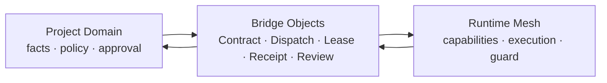

# Concord Protocol v0.2.0-alpha

[中文版](README.zh-CN.md)

> An executable governance and contract layer for file-driven multi-agent collaboration.

**This is a pilot-validated alpha, not a mature standard or an OS sandbox.** It answers four questions for every agent system:

1. **Who are you?** — `AgentIdentity`
2. **What can you do?** — `CapabilityRecord` + `AgentBoundary`
3. **How do you prove you stayed within bounds?** — `RuntimeGuard` + `AuditLog`
4. **How do projects and runtimes stay decoupled?** — `Domain Separation Model` + Bridge Objects

## What this is

A protocol for multiple AI agents to collaborate in shared or distributed workspaces without sharing unrestricted project context or runtime authority. Projects express intent and approval through contracts. Runtime workers claim bounded leases, execute with minimum context, and return verifiable receipts. Domain separation keeps project facts and runtime state isolated, connected through Bridge Objects.



Concord is complementary to connectivity and orchestration standards:

- MCP connects agents to tools and context.
- A2A connects agents to other agents.
- Agent frameworks provide orchestration, persistence, and execution runtimes.
- Concord defines business-facing boundaries, cross-domain contracts, authorization evidence, revocation, and audit receipts.

## What this is NOT

- ❌ A sandbox or container — `guarded_verify` validates and rejects invalid results, but does **not** intercept every OS-level read or write.
- ❌ A general-purpose agent framework — Concord does not provide model hosting, queues, scheduling, memory, or tool transport.
- ❌ A complete multi-agent solution — You bring your own agents, skills, task queues, and business logic. This protocol adds the security layer.

## Current release

`v0.2.0-alpha` adds the pilot-validated Bridge Loop and executable Guarded Upload contracts:

- `TaskContract -> TaskDispatch -> TaskLease -> ExecutionReceipt -> ReviewResult`
- Project / Runtime domain separation and minimum context disclosure
- `guarded_verify`, external artifact references, secret stripping, and protocol locks
- Approval grants bound to artifact hash, channel, privacy ceiling, and expiration
- HMAC proof validation, revocation-list checks, idempotency, and negative tests

The original v0.1 security kernel remains available as the conceptual foundation. Full OS-level prevention remains outside this release.

## Structure

```
├── README.md
├── LICENSE                          (Apache-2.0)
├── SECURITY.md                      (known limitations, security model)
├── GOVERNANCE.md                    (how the protocol evolves)
├── protocol/
│   ├── reusable-multi-agent-protocol-v0.1.md
│   ├── domain-separation-model-v0.1.md      (Project/Runtime isolation + Bridge Objects)
│   ├── domain-separation-diagrams-v0.1.md   (Mermaid diagrams)
│   ├── concord-bridge-hardening-v0.2.md      (pilot-validated bridge constraints)
│   └── v0.2-roadmap.md                      (bridge hardening roadmap)
├── framework/
│   ├── framework-security-kernel-v0.1.md   (V0.1 execution target — 6 objects)
│   └── framework-extended-draft.md         (full 11-object design reference)
├── schemas/                         (JSON Schema for each object)
├── reference/
│   └── file_bus_guard_v0.md         (reference implementation guide)
└── examples/
    └── minimal_project/             (minimal working example)
```

## Five-minute quick start

Install the validator and run the test suite:

```bash
python3 -m venv .venv
. .venv/bin/activate
python3 -m pip install -r requirements.txt
python3 -m unittest discover -s tests -v
```

Validate a Guarded Upload contract:

```bash
python3 tools/validate_guarded_upload_contract.py /path/to/task_contract.json
```

Then read in this order:

1. [`protocol/reusable-multi-agent-protocol-v0.1.md`](protocol/reusable-multi-agent-protocol-v0.1.md) — Four-layer model, capability-driven roles, committee governance.
2. [`framework/framework-security-kernel-v0.1.md`](framework/framework-security-kernel-v0.1.md) — The 6 core objects + 2 execution mechanisms you actually implement.
3. [`protocol/domain-separation-model-v0.1.md`](protocol/domain-separation-model-v0.1.md) — Project/Runtime isolation, distributed task bridge objects, leases, and receipts.
4. [`protocol/domain-separation-diagrams-v0.1.md`](protocol/domain-separation-diagrams-v0.1.md) — Mermaid diagrams for the domain separation architecture.
5. [`protocol/v0.2-roadmap.md`](protocol/v0.2-roadmap.md) — Roadmap for bridge object hardening and validation.
6. [`protocol/v0.2-pilot-plan.md`](protocol/v0.2-pilot-plan.md) — First pilot plan for validating the bridge loop.
7. [`protocol/concord-bridge-hardening-v0.2.md`](protocol/concord-bridge-hardening-v0.2.md) — Pilot-validated lifecycle, secret stripping, external artifact, guard, and protocol-lock rules.
8. [`reference/file_bus_guard_v0.md`](reference/file_bus_guard_v0.md) — Reference implementation pseudocode.
9. [`examples/minimal_project/`](examples/minimal_project/) — A minimal two-agent project showing the protocol in action.
10. [`examples/bridge_loop_pilot/`](examples/bridge_loop_pilot/) — Draft bridge object templates for the v0.2 pilot.
11. [`examples/protocol_lock.example.json`](examples/protocol_lock.example.json) — Non-production protocol lock example.
12. [`protocol/guarded-upload-task-contract-v0.2.md`](protocol/guarded-upload-task-contract-v0.2.md) — Guarded upload authorization and execution contract.
13. [`protocol/upload-negative-test-matrix-v0.2.md`](protocol/upload-negative-test-matrix-v0.2.md) — Required rejection and smoke-test matrix.

Blacklight Runtime is the production reference implementation used to validate these contracts. It is maintained separately so protocol definitions, deployable execution code, and project facts can evolve independently.

## Version

- **v0.1-alpha** — Security kernel and domain-separation foundation. `verify_only` mode.
- **v0.2.0-alpha** — Pilot-validated Bridge Loop, contract split, `guarded_verify`, approval evidence, HMAC verification, revocation, protocol locks, and executable rejection tests.

See [CHANGELOG.md](CHANGELOG.md) for release details and [CONTRIBUTING.md](CONTRIBUTING.md) for protocol proposals.

## License

Apache-2.0. See [LICENSE](LICENSE).

## Why not MIT?

Apache-2.0 includes an explicit patent grant, which is important for a protocol/framework that others may implement commercially. If someone contributes a novel verification method, the patent grant ensures all implementors can use it.
