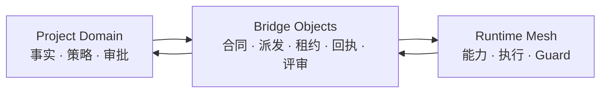

# Concord Protocol v0.2.0-alpha

> 面向文件驱动多 Agent 协作的可执行治理与合同层。

**这是经过 pilot 验证的 alpha 版本，不是成熟标准，也不是 OS 沙箱。** 它回答四个问题：

1. **你是谁？** — `AgentIdentity`
2. **你能做什么？** — `CapabilityRecord` + `AgentBoundary`
3. **你怎么证明没有越界？** — `RuntimeGuard` + `AuditLog`
4. **项目和运行时如何解耦？** — `Domain Separation Model` + Bridge Objects

## 这是什么

一套让多个 AI Agent 在共享或分布式工作区中受控协作的协议。Project 通过合同表达业务意图与授权，Runtime Worker 领取有边界的租约，以最小上下文执行，并返回可验证回执。域分离模型把项目事实与运行状态隔离，只允许通过 Bridge Objects 交互。



Concord 与行业连接层、编排层互补：MCP 负责 Agent 与工具，A2A 负责 Agent 与 Agent，Agent Framework 负责编排和运行；Concord 负责业务边界、跨域合同、授权证据、撤销与审计回执。

## 这不是什么

- ❌ 沙箱或容器 — `guarded_verify` 可以验证并拒绝无效结果，但不会拦截所有 OS 级读写。
- ❌ 通用 Agent 框架 — Concord 不提供模型托管、队列、调度、记忆或工具传输。
- ❌ 完整的 Agent 解决方案 — 你自带 Agent、skills、任务队列、业务逻辑。这个协议只加安全层。

## 当前版本

`v0.2.0-alpha` 增加了经 pilot 验证的 Bridge Loop 与可执行 Guarded Upload 合同：

- `TaskContract -> TaskDispatch -> TaskLease -> ExecutionReceipt -> ReviewResult`
- Project / Runtime 域分离与最小上下文披露
- `guarded_verify`、外部产物引用、密钥过滤与协议锁
- 与产物哈希、频道、隐私上限和有效期绑定的 ApprovalGrant
- HMAC 校验、撤销列表、幂等键和负向测试

v0.1 安全内核仍是概念基础；完整 OS 级强制隔离不属于本版本。

## 五分钟开始

```bash
python3 -m venv .venv
. .venv/bin/activate
python3 -m pip install -r requirements.txt
python3 -m unittest discover -s tests -v
python3 tools/validate_guarded_upload_contract.py /path/to/task_contract.json
```

## 阅读顺序

1. [`protocol/reusable-multi-agent-protocol-v0.1.md`](protocol/reusable-multi-agent-protocol-v0.1.md) — 四层模型、能力驱动角色、委员会治理。
2. [`framework/framework-security-kernel-v0.1.md`](framework/framework-security-kernel-v0.1.md) — 6 个核心对象 + 2 个执行机制，你需要实际实现的部分。
3. [`protocol/domain-separation-model-v0.1.md`](protocol/domain-separation-model-v0.1.md) — Project/Runtime 隔离、分布式任务桥接对象、租约和回执。
4. [`protocol/domain-separation-diagrams-v0.1.md`](protocol/domain-separation-diagrams-v0.1.md) — 域分离架构的 Mermaid 图表。
5. [`protocol/v0.2-roadmap.md`](protocol/v0.2-roadmap.md) — Bridge Object 加固与验证路线图。
6. [`protocol/v0.2-pilot-plan.md`](protocol/v0.2-pilot-plan.md) — v0.2 Bridge Loop 首次试点计划。
7. [`protocol/concord-bridge-hardening-v0.2.md`](protocol/concord-bridge-hardening-v0.2.md) — 经 pilot 验证的生命周期、密钥过滤、外部产物、Guard 与协议锁规则。
8. [`reference/file_bus_guard_v0.md`](reference/file_bus_guard_v0.md) — 参考实现伪代码。
9. [`examples/minimal_project/`](examples/minimal_project/) — 一个最小两 Agent 示例项目。
10. [`examples/bridge_loop_pilot/`](examples/bridge_loop_pilot/) — v0.2 试点 Bridge Object 模板。
11. [`examples/protocol_lock.example.json`](examples/protocol_lock.example.json) — 不可用于生产的协议锁示例。
12. [`protocol/guarded-upload-task-contract-v0.2.md`](protocol/guarded-upload-task-contract-v0.2.md) — 受控上传授权与执行合同。
13. [`protocol/upload-negative-test-matrix-v0.2.md`](protocol/upload-negative-test-matrix-v0.2.md) — 必须通过的拒绝测试与 smoke test 矩阵。

验证 Guarded Upload 合同：

```bash
python3 -m pip install -r requirements.txt
python3 tools/validate_guarded_upload_contract.py /path/to/task_contract.json
python3 -m unittest discover -s tests -v
```

## 核心模型

```
Shared Layers      → Protocol / Framework / Application
Isolated Domains   → Project Domain / Runtime Mesh Domain
Bridge Layer       → TaskContract / TaskLease / ExecutionReceipt / ReviewResult
```

## 版本

- **v0.1-alpha** — 安全内核与域分离基础，`verify_only` 模式。
- **v0.2.0-alpha** — 经 pilot 验证的 Bridge Loop、合同拆分、`guarded_verify`、审批证据、HMAC、撤销、协议锁和可执行拒绝测试。

版本变化见 [CHANGELOG.md](CHANGELOG.md)，参与协议演进见 [CONTRIBUTING.md](CONTRIBUTING.md)。

## License

Apache-2.0。包含专利授权条款，适合协议/框架类项目。

## 关于命名

**Concord** = 共识、协调、一致。映射多 Agent 委员会先达成架构共识、再进入项目执行的核心流程。

---

[English version](README.md)
