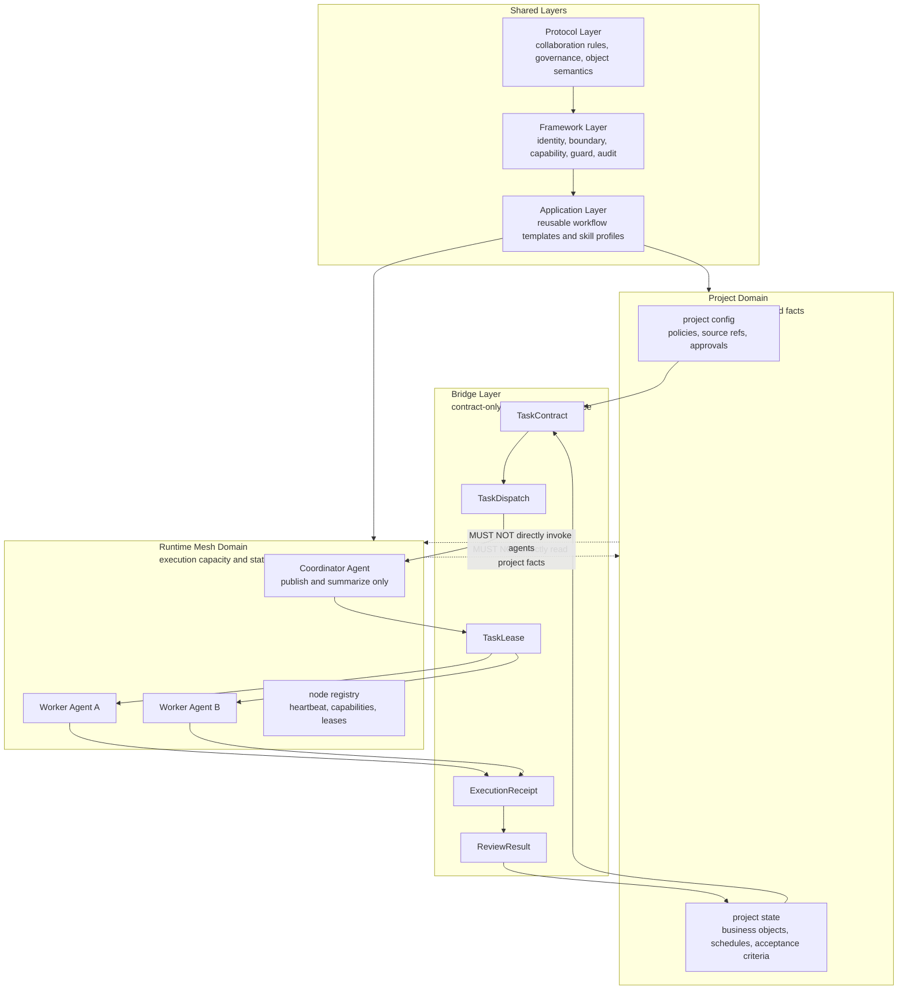
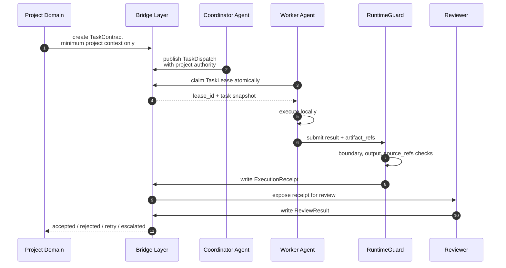
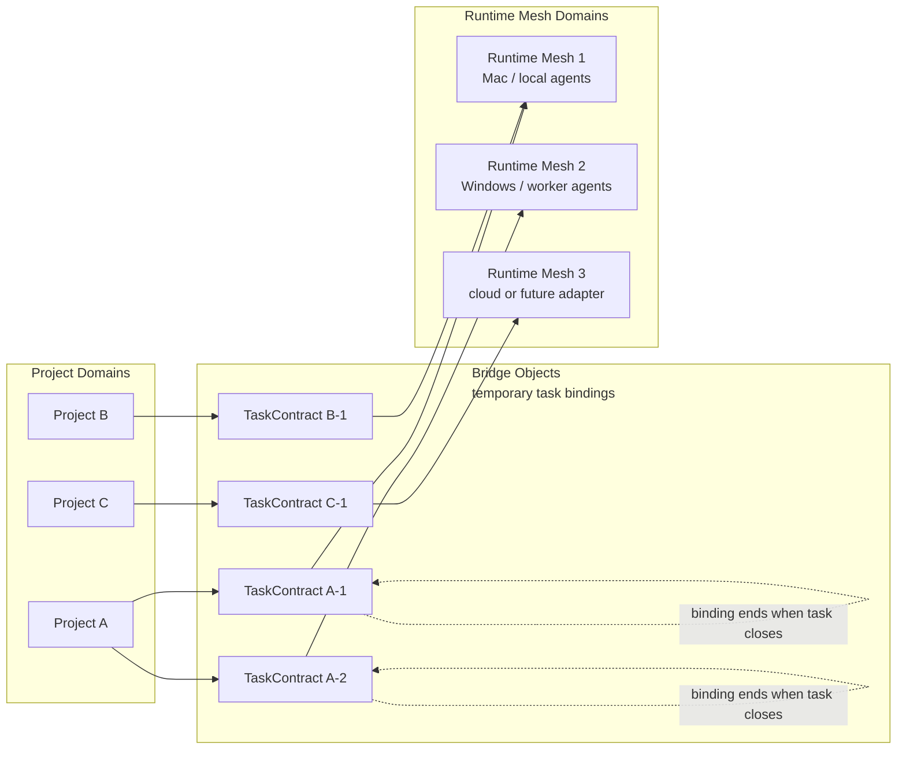
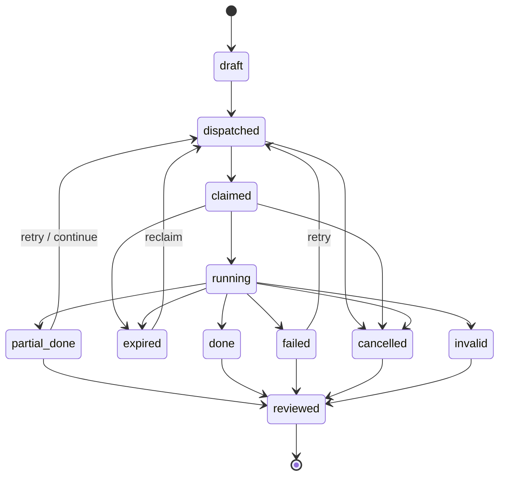
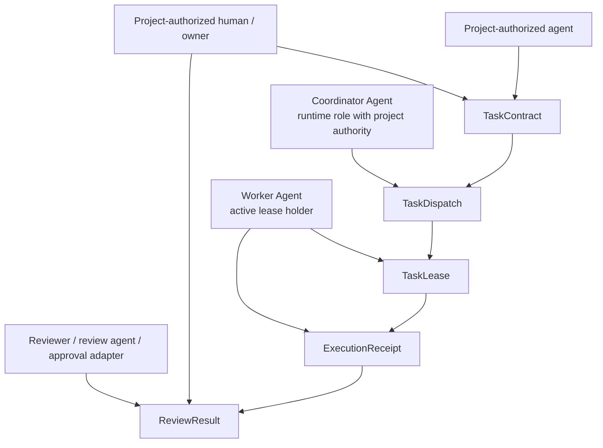
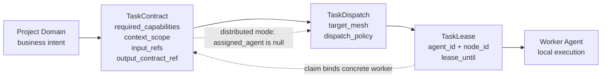
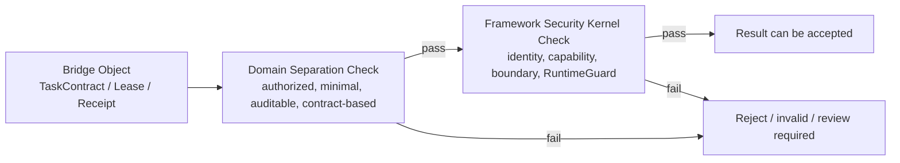

# Domain Separation Diagrams v0.1

> Visual companion for [Domain Separation Model v0.1](domain-separation-model-v0.1.md).

---

## 1. Architecture Overview

---

## 2. Cross-Domain Task Flow

---

## 3. Many-to-Many Project Runtime Binding

---

## 4. Task Lifecycle

---

## 5. Bridge Object Authority

---

## 6. TaskContract to Lease Binding

---

## 7. Security Kernel Relationship

